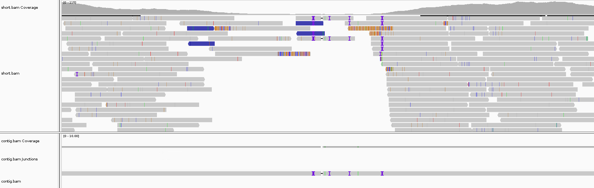

### local_assembly_and_alignment 1.0  
#### A Perl scripts to call SV position from mapped.bam.

**Install;** run __"mamba install -c bioconda -y bamutil samtools spades seqkit"__
**Input:** Paired-end short read bam(-b) and their reference.fasta(-f). Chr (-r), start (-s), and end position (-e), respectively.   
**Output:** Bam file; locally assembled contig from the reads in user specified region  
**Usage:** perl local_assembly_and_alignment.pl -f assembly.fasta -r chr1 -s 100 -e 1000 -b mapping.bam  

## Requirements  
- SAMTools  (version >= 1.3.1)  
- SPAdes (version >= 3.15)  
- seqkit
- bamutil


Install Anaconda (Mac OS X, Linux).  
## Dependency
```
mamba create -n local_assembly_and_alignment -y
conda activate local_assembly_and_alignment
mamba install -c bioconda spades samtools seqkit bamutil -y
```
   
## Source
```
cd $HOME 
git clone git@github.com:kazumaxneo/local_assembly_and_alignment.git
cd local_assembly_and_alignment/
echo export PATH=\$PATH:`pwd`\ >> ~/.bash_profile && source ~/.bash_profile
local_assembly_and_alignment.pl
```

<p align="center"></p>
